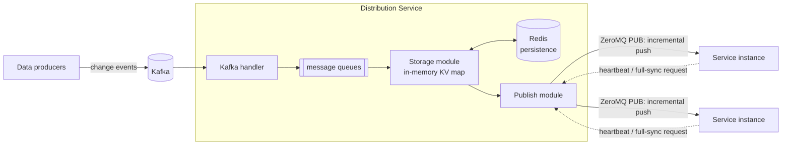
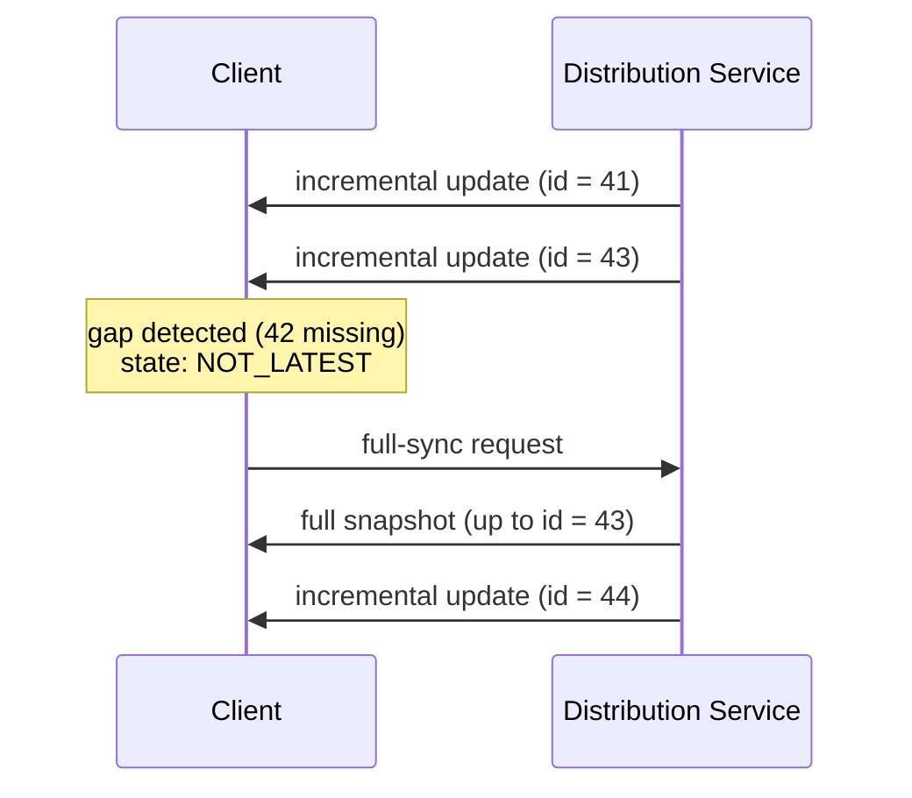

# Motivation
In a previous industry project, I got involved in building a **real-time data distribution service** in C++. The problem it solves is a classical one in large backend clusters: many online services depend on the same set of **small but frequently updated data** — dictionaries, business configurations, feature metadata, etc. If every service instance queried the central database directly:

- the database would be hammered by massive amounts of repeated reads;
- polling-style refresh introduces staleness — services always act on data that is seconds or minutes old;
- every business team re-implements its own cache/refresh logic, again and again.

The idea is to introduce **one dedicated distribution layer** in between: it subscribes to data changes *once*, keeps an authoritative copy, and **pushes** updates to all downstream service instances with sub-second latency. Downstream services simply hold a local replica in memory and enjoy zero-RPC reads.

# Architecture
The service sits between the data producers and the online services:

Three modules cooperate inside the service, decoupled by in-memory message queues so each runs in its own thread(s):

**Ingestion (handlers)**
: A set of pluggable handlers assembled by a *Distributor*. At startup, the MySQL/Redis handlers bootstrap the full dataset; afterwards, a Kafka handler (built on the asynchronous task model of [Sogou C++ Workflow](https://github.com/sogou/workflow)) keeps consuming change events.

**Storage**
: Maintains the authoritative state as an in-memory KV map, and periodically synchronizes records to **Redis**. So a restarted instance recovers from Redis instead of replaying the whole history.

**Publish**
: Fans out updates to downstream clients over **ZeroMQ**, with separate sockets for incremental push, full-snapshot transfer and heartbeat/response.

# Key Technical Points

## Incremental push + full sync, on separate channels
Day-to-day traffic is tiny incremental updates over a PUB/SUB socket — one publish reaches all subscribers. But pub/sub alone is not reliable: a client may join late, restart, or drop messages. So every update carries a **monotonically increasing id**; a client compares the id it receives against the id it expects, and once a gap is detected (a `NOT_LATEST` state), it requests a **full snapshot** through a dedicated socket, then switches back to the incremental stream:

Keeping the bulky snapshot transfer off the incremental channel matters: a slow catching-up client never blocks the low-latency path that everyone else relies on.

## Liveness via heartbeats
Clients report heartbeats on a response channel, so the service knows who is alive and can log/alert on silent subscribers — with pure PUB/SUB the publisher would otherwise be completely blind to its audience.

## Asynchronous, lock-light pipeline
All cross-module communication goes through mutex-protected in-memory queues, and networking/Kafka consumption is fully asynchronous on top of the Workflow task engine. Each module only touches its own queue ends, which keeps the critical sections short and the pipeline stages independently scalable.

# Summary
The overall shape — *Kafka in, replicated KV state inside, ZeroMQ push out* — is simple, but the reliability details (id-based gap detection, dual channel for incremental/full sync, heartbeats, Redis-backed recovery) are what make a push-based distribution service actually usable in production. With this layer in place, downstream services read hot data from local memory at zero cost, while updates still propagate across the cluster within sub-second latency.
